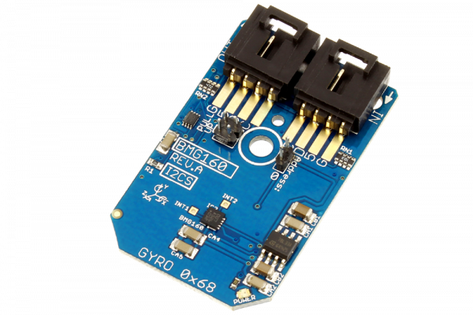

# BMG160

The Bosch Sensortec’s BMG160 is a digital 3-axis angular rate sensor which ranges up to 2000°/s and a digital resolution of 16-bit for consumer electronics applications.It is capable to measure angular rates and three perpendicular room demensions, the x-, y- and z-axis, and to provide the corresponding output signals.The BMG160 also allows low-noise measurement.
This Device is available from www.ncd.io 

[SKU: BMG160_I2CS]

(https://store.ncd.io/product/bmg160-16-bit-triaxial-%C2%B1125s-to-%C2%B12000s-gyroscope-sensor-i2c-mini-module/)
This Sample code can be used with Arduino.

Hardware needed to interface BMG160 sensor with Arduino

1. <a href="https://store.ncd.io/product/i2c-shield-for-arduino-nano/">Arduino Nano</a>

2. <a href="https://store.ncd.io/product/i2c-shield-for-arduino-micro-with-i2c-expansion-port/">Arduino Micro</a>

3. <a href="https://store.ncd.io/product/i2c-shield-for-arduino-uno/">Arduino uno</a>

4. <a href="https://store.ncd.io/product/dual-i2c-shield-for-arduino-due-with-modular-communications-interface/">Arduino Due</a>

5. <a href="https://store.ncd.io/product/bmg160-16-bit-triaxial-%C2%B1125s-to-%C2%B12000s-gyroscope-sensor-i2c-mini-module/">BMG160 3-Axis Gyroscope Sensor</a>

6. <a href="https://store.ncd.io/product/i%C2%B2c-cable/">I2C Cable</a>

BMG160:

The Bosch Sensortec’s BMG160 is a digital 3-axis angular rate sensor which ranges up to 2000°/s and a digital resolution of 16-bit for consumer electronics applications.It is capable to measure angular rates and three perpendicular room demensions, the x-, y- and z-axis, and to provide the corresponding output signals.The BMG160 also allows low-noise measurement.

Applications:

•Indoor navigation,gesture recognition,computer peripherals,man-machine interfaces,virtual reality features,remote and game controllers, etc.

How to Use the BMG160 Arduino Library
The BMG160 has a number of settings, which can be configured based on user requirements.

1.Gyro range selection:The following command is used to set the gyro range as ± 2000 °/s. 

             bmg.setGyroRange(GYRO_RANGE_2000);                      // ± 2000 °/s
             
2.Bandwidth selection:The following command is used to set the bandwidth as 23Hz.    
             
              bmg.setGyroBandwidth(GYRO_BANDWIDTH_200_23HZ);       // ODR: 200 Hz, Filter Bandwidth: 23 Hz
              
3.X-Axis measurement:The following command is used to measure the value of gyrosensor at X-Axis.              
             
              bmg.bmg_gyroData.X
              
4..Y-Axis measurement:The following command is used to measure the value of gyrosensor at Y-Axis.   
            
              bmg.bmg_gyroData.Y
              
5..Z-Axis measurement:The following command is used to measure the value of gyrosensor at Z-Axis.                
              
              bmg.bmg_gyroData.Z
